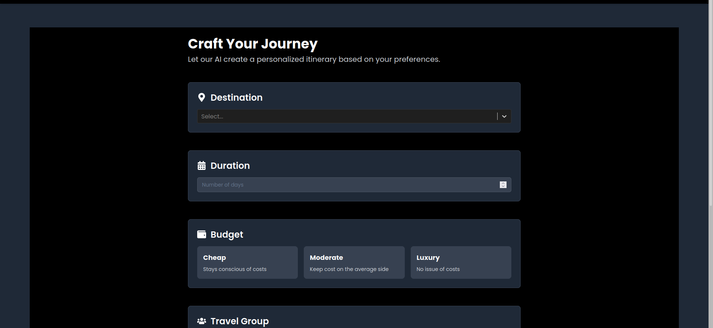

# **PlanIT - Personalized Itinerary Generator**

**PlanIT** is a travel itinerary generator that enables users to create customized travel plans based on preferences such as budget, number of days, and number of travelers. With integrations like Google Places, users can explore and save travel itineraries that include hotels, activities, and destinations.

---

## **Table of Contents**
- [Features](#features)
- [Technologies Used](#technologies-used)
- [Installation](#installation)
- [Environment Variables](#environment-variables)
- [Usage](#usage)
- [Contributing](#contributing)

---

## **Links and Project Screenshots**

- **Project Doc**: ([Doc](https://docs.google.com/document/d/1k-BxbRbzpT7uYCUxzvuojzUCROlO2CPk5q0q0HwtHmg/edit?usp=sharing))
- 
- 
- 


---
## **Features**

- **User Authentication**: Secure user authentication using JWT tokens for login and signup.
- **Itinerary Generation**: Create personalized itineraries based on input criteria like budget, travel days, and number of travelers.
- **Google Places and Gemini 1.5 Integration**: Fetch relevant details on hotels, activities, and destinations using Google Places API.
- **Saved Itineraries**: Users can save and view their previously generated itineraries.
- **Responsive Design**: User-friendly and responsive design powered by Tailwind CSS, adaptable to both mobile and desktop devices.

---

## **Technologies Used**

### **Frontend**
- **Next.js**: React framework for server-side rendering and static site generation.
- **TypeScript**: Statically typed superset of JavaScript.
- **Tailwind CSS**: Utility-first CSS framework for responsive and modern design.
- **Axios**: Promise-based HTTP client for API requests.
- **Framer Motion**: Animations and gesture handling for React.

### **Backend**
- **Express.js**: Minimal and flexible Node.js framework for building APIs.
- **TypeScript**: Ensures type safety and code maintainability.
- **Mongoose**: ODM for MongoDB, used for modeling application data.
- **JWT**: JSON Web Tokens for secure user authentication.

### **Database**
- **MongoDB**: NoSQL database for storing user data and itineraries.

---

## **Installation**

1. Clone the repository:
   ```bash
   git clone https://github.com/your-username/planIT.git
   cd planIT
   ```

2. **Install dependencies** for both frontend and backend:
   - Frontend:
     ```bash
     cd frontend
     npm install
     ```
   - Backend:
     ```bash
     cd backend
     npm install
     ```

3. Set up the environment variables (see [Environment Variables](#environment-variables)).

4. **Run the frontend and backend**:
   - Frontend:
     ```bash
     npm run dev
     ```
   - Backend:
     ```bash
     npm start
     ```

---

## **Environment Variables**

Create `.env` files for both frontend and backend in their respective directories.

### **Frontend (.env)**

```plaintext
NEXT_PUBLIC_BASE_URL=http://localhost:5000
NEXT_PUBLIC_GOOGLE_PLACE_API_KEY=your-google-places-api-key
NEXT_PUBLIC_GEMINI_API_KEY=your-gemini-api-key
```

### **Backend (.env)**

```plaintext
MONGO_URI=your-mongodb-connection-string
JWT_SECRET=your-jwt-secret
REDIS_URL=your-redis-url
GOOGLE_PLACE_API_KEY=your-google-places-api-key
```

---

## **Usage**

### **Frontend**
- Navigate to `http://localhost:3000` to use the frontend.
- Sign up or log in to access your personalized travel dashboard.
- Generate itineraries by entering details such as budget, number of days, and travelers.
- Save itineraries and view them later in your dashboard.

### **Backend**
- The backend will run on `http://localhost:5000` and handles API requests from the frontend.
- It interacts with MongoDB to store user data and Redis for caching and session management.
  
---


### **External API Integration**
- **Google Places and Gemini 1.5 API**: Integrated via backend to fetch data for hotels, activities, and destinations.

---

## **Contributing**

We welcome contributions to **PlanIT**! If you'd like to contribute, please follow these steps:

1. Fork the repository.
2. Create a new branch (`git checkout -b feature/your-feature-name`).
3. Commit your changes (`git commit -m 'Add some feature'`).
4. Push to the branch (`git push origin feature/your-feature-name`).
5. Open a Pull Request.

---
